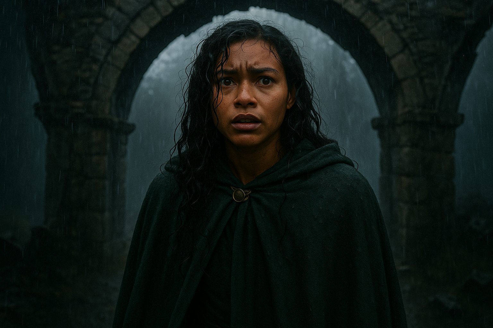
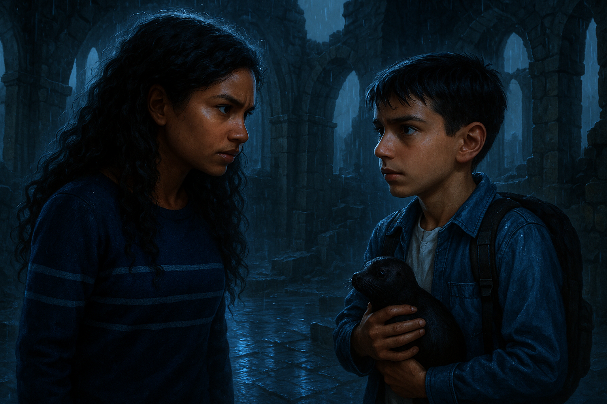
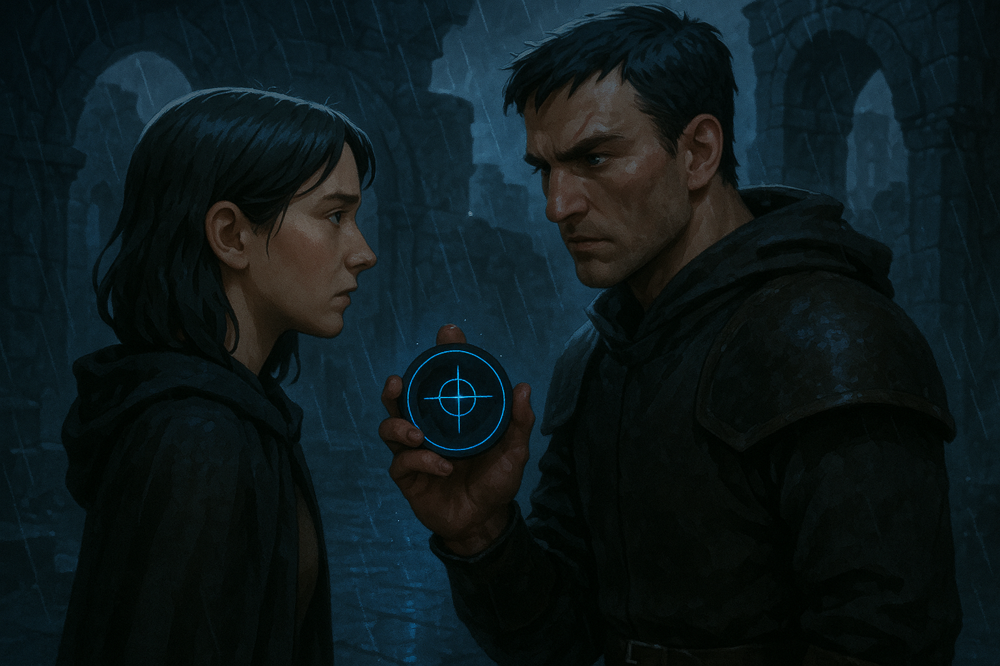
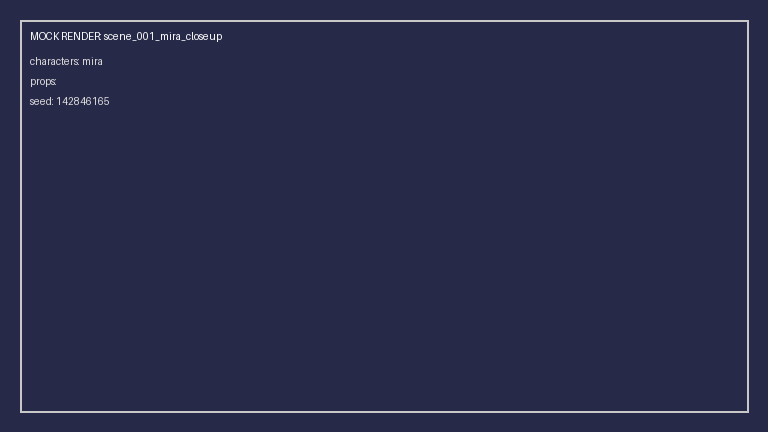
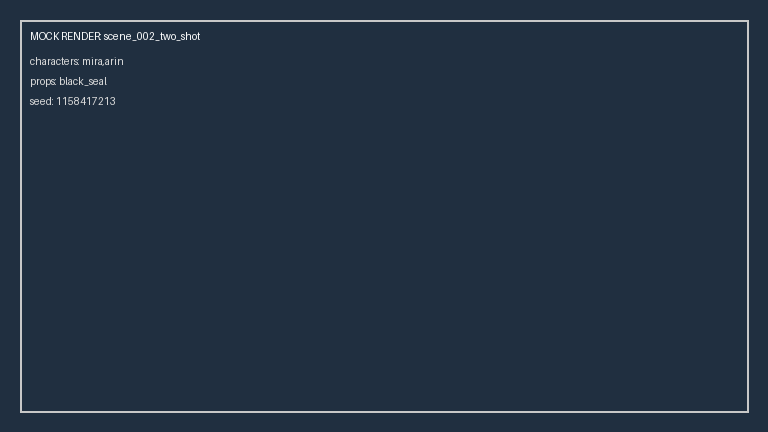

# Example Renders

Real output from this pipeline, generated end-to-end through the FastAPI server and CLI
against the real **OpenAI `gpt-image-1`** provider, using the reference conditioning
contract built from `provided_inputs/`.

## Scene 1 — `scene_001_mira_closeup`

> Mira stands under the broken arch in rain, realizing something is wrong. Her green cloak
> and brass clasp are clearly visible.



QA verdict: **approved**. Matches the visual bible closely — deep green hooded cloak,
brass clasp, broken stone arch, rain, dark curly hair, warm brown skin, "suspenseful,
controlled fear."

## Scene 2 — `scene_002_two_shot`: a real bug, found and fixed

The first real run of this scene surfaced a genuine finding, not a hypothetical:



`gpt-image-1` interpreted the prop entity `black_seal` (an obsidian, rune-engraved
talisman with a thin blue glow, per `visual_bible.json`) **literally as a baby seal
animal**. For comparison, here's an actual seal pup — this is very likely what the model's
own training association pulled toward when it saw `entity_id: "black_seal"` with no other
disambiguating signal in the prompt:


*Public domain, U.S. Fish and Wildlife Service — [Wikimedia Commons](https://commons.wikimedia.org/wiki/File:Seal_pup_cute_marine_mammal.jpg). Used here only as an illustrative comparison, never as a generation input.*

This QA-passed as `approved` at the time, and that was itself the real finding:
`validate_scene_consistency` only checked that a `black_seal` reference was *resolved and
passed* to the provider (`reference_images_used` did include the prop PNG) — not whether
the rendered pixels actually matched what that reference depicts. A textbook case for why
the assignment lists embedding/CLIP-based similarity as a bonus QA check.

### Root cause and fix

Tracing it further found the actual bug: `select_generation_strategy` built the render
prompt from `scene.prompt_intent` **verbatim** — the rich `preserve_facets` metadata
already sitting on every `TypedRef` in the reference conditioning contract
(`round_shape`, `black_obsidian_material`, `thin_blue_glow`, `engraved_rune` for Black
Seal) never actually reached the provider. The contract *knew* what the prop was; the
prompt just never said so.

Fixed in `_grounded_prompt()` (`src/graph/nodes.py`): the render prompt now appends a
clause per required character/prop built directly from the contract's own
`preserve_facets`, and props get an explicit "inanimate object, not an animal" clause
disambiguating against exactly this kind of literal name misreading. The synthetic
placeholder (`black_seal_ref.png`) was also redrawn from a generic face-shaped swatch into
an unambiguous round rune-marked obsidian disc. Re-running the identical scene afterward:



The actual grounded prompt sent for this re-render:

> Mira confronts Arin in the ruined watchtower. Arin hides the black seal in his hand. Rain
> reflects the blue glow on wet stone. Mira must show: face_identity, hair_color,
> skin_tone, core_silhouette. Arin must show: face_identity, hair_shape,
> scar_over_right_brow, guard_leather_silhouette. **Black Seal is an inanimate object/prop,
> not an animal or living creature -- it must show: round_shape, black_obsidian_material,
> thin_blue_glow, engraved_rune.**

Covered by `tests/test_prompt_grounding.py`.

## Mock provider output, for comparison

`MockProvider` is what every test and the committed `outputs/sample_run/` actually run
against — deterministic placeholders, not attempts at real images:

| Scene | Mock (`outputs/sample_run/`) |
|---|---|
| `scene_001_mira_closeup` |  |
| `scene_002_two_shot` |  |

## How to reproduce

```bash
docker compose up -d   # optional, only needed for --persist / DynamoDB Local
uvicorn src.api.app:app --reload --env-file .env --port 9090
curl -s -X POST http://localhost:9090/v1/image-consistency/render \
  -H "Content-Type: application/json" \
  -d @scripts/render_request_openai.json
```

See README.md's "Chosen image provider" section for the CLI equivalent and the port-
collision note (uvicorn's default `8000` collides with DynamoDB Local's `docker-compose.yml`
port).
